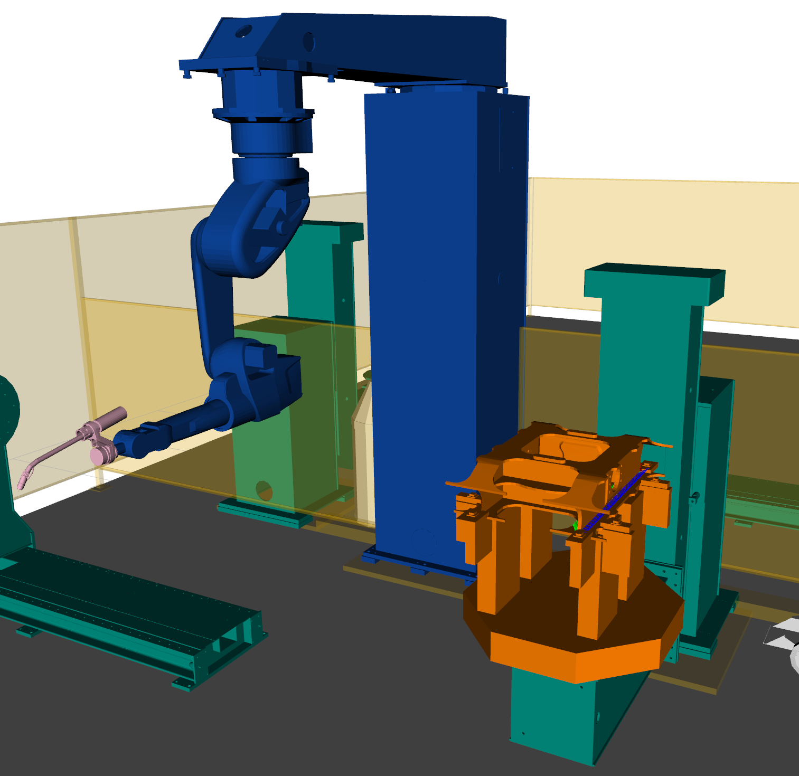
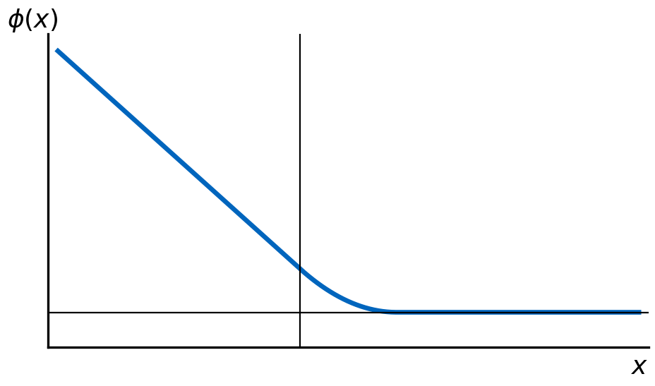
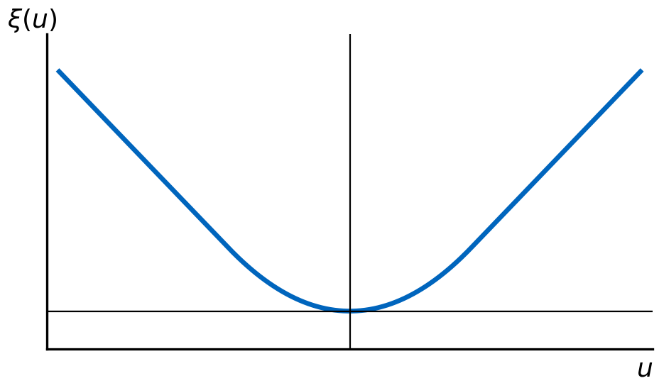
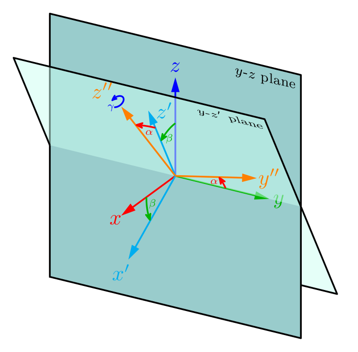
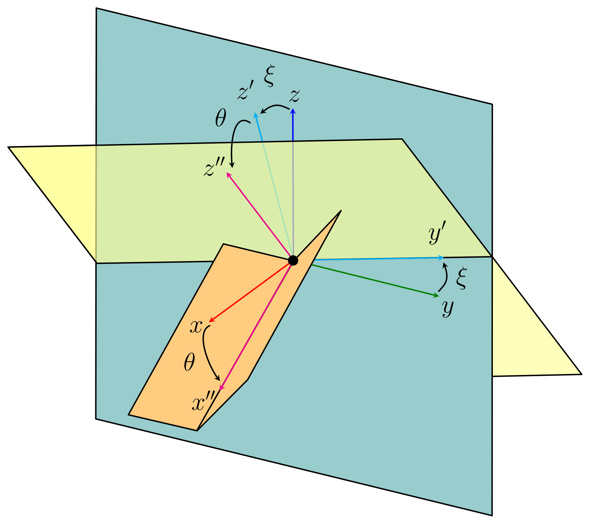

## Úvod — motivace a cíle {.smaller background-color="#ffffff"}

::: {.columns}
::: {.column width="45%"}
- **Motivace:** Odstranění zdlouhavého manuálního programování (učení) robota.
- **Cíl:** Plně automatizované generování trajektorií pro složité prostorové svary.

::: {.roadmap}
**Klíčové přínosy:**

1. **Kinematika:** Analytická IKT2 + IKT6.
2. **Plánování:** Kombinace IKT2 s IKT6 a **relaxací**.
3. **Výběr řešení:** Záchrana proveditelnosti a plynulé trajektorie.
:::
:::
::: {.column width="55%"}
{.intro-fig}
:::
:::

::: {.notes}
~60 s.

- Rád bych vám představil naše **svařovací pracoviště** — **devítiosou** robotickou buňku.
- Jde o koordinaci **tří částí**: **dvouosé polohovadlo**, **šestiosé robotické rameno** a **jedna externí rotační osa**.
- Cílem mé práce bylo tento systém **plně zautomatizovat**.
- Tedy na základě vstupního **G-kódu** automaticky vygenerovat kompletní svařovací trajektorii.
- Vpravo na slidu vidíte vizualizaci v prostředí **RViz**, kde je zobrazen robot, externí osa i polohovadlo.
- **Oranžově** je znázorněn samotný svařovaný model.
:::

## Přehled systému {.smaller}

::: {.columns}
::: {.column width="44%"}
**Plánovací systém a vizualizace**

- 1 externí rotační osa
- 6-osé robotické rameno
- 2-osé polohovadlo
:::
::: {.column width="56%"}
**Programová pipeline**

::: {.incremental}
1. **Parser vstupu:** Extrakce dráhy a svařovacích póz z G-kódu.
2. **Plánování svarů:** Kombinace analytické IK (IKT2, IKT6) a výběr řešení (Ceres Solver).
3. **Přejezdy (G0):** Hledání bezkolizních cest v 9D prostoru (OMPL RRT-Connect).
4. **Exekuce:** Časová parametrizace a vykonání trajektorie (MoveIt 2).
5. **Kombinatorická optimalizace:** Výběr optimální větvy kloubového řešení a globální vyhlazení.
:::
:::
:::

::: {.notes}
~55 s.

- **[Úvod]** Nyní se podíváme na samotnou plánovací pipeline — **4 klíčové fáze**.
- **1. Zpracování G-kódu:** Začínáme zpracováním → získáme potřebné **pozice pro svařování**.
- **2. Volnoprostorové plánování:** Jakmile máme pozice, potřebujeme se **bezpečně a bez kolizí** dostat z parkovací pozice k prvnímu svaru.
- **3. Kombinatorická optimalizace:** Redundance systému = **mnoho analytických řešení** inverzní kinematiky.
- Tento krok nám pomůže vybrat to **nejlepší řešení**.
- **4. Kontinuální optimalizace:** Vytvoří finální **plynulou trajektorii**, která splňuje všechny limity a omezení.
:::

## Označení: klouby, relaxace, kritéria {.smaller}

::: {.columns}
::: {.column width="30%"}
**Klouby (9 DOF)**

- **Externí osa (1 DOF):** `joint_71` (E)
- **Rameno — IKT6 (6 DOF):**
  S, L, U, R, B, T
- **Polohovadlo — IKT2 (2 DOF):**
  `joint_94` (tilt), `joint_95` (rotate)

{width="133%"}
:::
::: {.column width="24%"}
**Relaxace svařovací pózy (5 DOF)**

*Hořák (3 DOF):*

- $\alpha$ — pracovní úhel
- $\beta$ — postupový úhel
- $\gamma$ — spin (volný)

*Polohovadlo (2 DOF):*

- $\xi$ — roll
- $\theta$ — slope
:::
::: {.column width="46%"}
::: {.columns}
::: {.column width="60%"}
**14 kritérií Ceres**

- *Manipulovatelnost a singularity:*
  trans_dex, rot_dex, Dt, Dr, ee_column_angle
- *Kinematická omezení:*
  velocity, acceleration, joint_limits, collision, region_I_boundary
- *Cíl a plynulost:*
  KIKT, prev_p_dist, Reachability, relaxation
:::
::: {.column width="40%"}
{width="100%"}

{width="100%"}
:::
:::
:::
:::

::: {.notes}
~45 s. Krátký „slovníček" — pojmy, na které budu odkazovat v následujících slidech.

- **Klouby (vlevo):** Systém má **devět stupňů volnosti**.
- Jednu **externí rotační osu** (`joint_71`).
- Šest os **robotického ramene** (analyticky řešeno **IKT6**, označení S, L, U, R, B, T).
- Dvě osy **polohovadla** (analyticky **IKT2** — tilt a rotation).
- **Relaxace (uprostřed):** Pět parametrů, o které dovolíme svařovací póze **odchýlit od ideálu**.
- Tři v rámci hořáku — **pracovní úhel α**, **postupový úhel β** a **spin γ** (vždy volný kvůli osové symetrii tavné elektrody).
- Dva jsou náklony dílu vůči gravitaci — **roll ξ** a **slope θ**.
- **14 kritérií (vpravo):** Jména účelových funkcí v **Ceres Solveru**, seskupené do **tří tematických bloků**.
- Detaily nejdůležitějších rozvedu na slidu o **plánování**.
:::

## Inverzní kinematika polohovadla (IKT2) {.smaller}

::: {.columns}
::: {.column width="46%"}
- **Analytická IKT2:** dvouosé polohovadlo v uzavřeném tvaru.
- **Zarovnání svaru:** $q_1, q_2$ pro optimální orientaci vůči gravitaci.
- **Vícenásobné větve:** vrací všechna platná řešení (typicky 2) v mezích kloubových limitů.
- **Základ pro optimalizaci:** rychlý a stabilní podklad pro Ceres Solver.
:::
::: {.column width="54%"}
::: {.columns}
::: {.column width="50%"}
{width="100%"}

*a) První konfigurace*
:::
::: {.column width="50%"}
{width="100%"}

*b) Druhá konfigurace*
:::
:::
:::
:::

::: {.notes}
~55 s.

- Na tomto snímku se zaměřím na **inverzní kinematiku polohovadla (IKT2)**.
- Analytické řešení IKT2 je **klíčové** — je **extrémně rychlé**, **spolehlivé** a vrací **všechny dostupné větvy řešení** v rámci fyzických limitů polohovadla.
- Cílem IKT2 je najít úhly kloubů polohovadla **q₁** a **q₂** tak, aby byl svar **správně orientován vůči gravitačnímu vektoru** pro ideální nanášení materiálu.
- Výpočet je **analytický (v uzavřeném tvaru)**.
- Odpadají tak problémy s **konvergencí**, které mívají běžné numerické řešiče.
- Toto analytické řešení slouží jako **pevný základ pro Ceres optimalizaci** zbývajících stupňů volnosti.
:::

## Relaxace hořáku (3 DOF) {.smaller}

Odklon nástroje v rámci hořáku: **pracovní úhel $\alpha$**, **postupový úhel $\beta$** a **spin $\gamma$** (vždy volný — osová symetrie hořáku).

::: {.columns}
::: {.column width="50%"}
{width="90%"}

*3 DOF na hořáku ($\mathbf{g}$ = gravitace).*
:::
::: {.column width="50%"}
{width="62%"}

*Pořadí rotací: $\beta \rightarrow \alpha \rightarrow \gamma$.*
:::
:::

::: {.notes}
~50 s. První ze dvou slidů o relaxaci — **relaxace ramene v rámci nástroje**.

- Vlevo **tři stupně volnosti** na hořáku: pracovní úhel $\alpha$, postupový úhel $\beta$ a spin $\gamma$.
- **Spin $\gamma$** je vždy **volný** kvůli **osové symetrii** tavné elektrody.
- **$\alpha, \beta$** omezuje technolog jen na **malý rozsah ± stupňů**.
- Vpravo **pořadí intrinsických rotací**, kterými relaxovaný rámec vznikne.
- Nejprve **$\beta$ kolem $y$**, pak **$\alpha$ kolem $z'$**, nakonec **$\gamma$ kolem $z''$**.
:::

## Relaxace polohovadla (2 DOF) {.smaller}

Náklon dílu vůči gravitaci: **roll $\xi$** (kolem osy X) a **slope $\theta$** (kolem osy Y) — malé odchylky od ideální polohy PA.

::: {.columns}
::: {.column width="45%"}
{width="98%"}

*Ideální poloha PA ($\xi = \theta = 0$).*
:::
::: {.column width="55%"}
{width="68%"}

*Definice úhlů roll $\xi$ a slope $\theta$.*
:::
:::

::: {.notes}
~50 s. Druhý slide o relaxaci — **relaxace polohovadla**.

- Vlevo **ideální poloha PA**: směr přístupu hořáku ($z$) přesně **proti gravitaci $\mathbf{g}$**, **nulový roll i slope**.
- Vpravo **definice obou úhlů**: relaxovaný rámec vznikne rotací o **$\xi$ kolem lokální osy $x$** a následně o **$\theta$ kolem nové osy $y'$**.
- **Bez relaxace** bychom v mnoha bodech **nenašli řešení**.
- Dodatečné DOF optimalizace využije k **vyhnutí se singularitám a kloubovým limitům**.
:::

## Plánování sekvence (Ceres Solver) {.smaller}

**Ceres funkce:**

- Manipulovatelnost, limity, rychlosti.
- Bezkoliznost (FCL), plynulost.
- Penalizace relaxace.

::: {.notes}
~70 s.

- Účelová funkce má **14 kritérií**.
- Mezi nimi **manipulovatelnost** $w(\mathbf{q}) = \sqrt{\det(\mathbf{J}\mathbf{J}^\top)}$.
- **Vzdálenost od kolizí** (FCL).
- **Plynulost** mezi svary.
- **Relaxační reziduum** je **CHOMP-style**.
:::

## Výsledky — experiment a srovnání {.smaller}

**Testovací díl:** Polygonální hranol. **2 scénáře:** bez relaxace vs. plná relaxace.

::: {.columns}
::: {.column width="50%"}
**Bez relaxace**

<video id="vid-norelax" class="screen-only" src="figures/workpiece1_non_relax.webm" autoplay muted playsinline style="width:100%; max-height:360px; border-radius:4px; background:#fff; object-fit:contain;"></video>


Skoky, vysoké rychlosti, **místy bez řešení**.
:::
::: {.column width="50%"}
**Plná relaxace (5 DOF)**

<video id="vid-relax" class="screen-only" src="figures/workpiece1_relax.webm" autoplay muted playsinline style="width:100%; max-height:360px; border-radius:4px; background:#fff; object-fit:contain;"></video>


Plynulé průběhy, **vždy řešitelné**.
:::
:::

```{=html}
<script>
(function () {
  function init() {
    var v1 = document.getElementById('vid-norelax');
    var v2 = document.getElementById('vid-relax');
    if (!v1 || !v2) return;

    var busy = false;
    function restartBoth() {
      if (busy) return;
      busy = true;
      try { v1.pause(); v2.pause(); v1.currentTime = 0; v2.currentTime = 0; } catch (e) {}
      Promise.all([
        v1.play().catch(function () {}),
        v2.play().catch(function () {})
      ]).finally(function () { busy = false; });
    }

    // When either clip finishes, restart both together — guarantees they
    // end at the same time and re-start on the same frame every cycle.
    v1.addEventListener('ended', restartBoth);
    v2.addEventListener('ended', restartBoth);

    // Re-sync whenever this slide becomes the current one (reveal.js).
    if (typeof Reveal !== 'undefined') {
      Reveal.on('slidechanged', function (e) {
        if (e.currentSlide && e.currentSlide.contains(v1)) restartBoth();
      });
      Reveal.on('ready', function () {
        var cur = (Reveal.getCurrentSlide && Reveal.getCurrentSlide()) || null;
        if (cur && cur.contains(v1)) restartBoth();
      });
    }
  }
  if (document.readyState === 'loading') {
    document.addEventListener('DOMContentLoaded', init);
  } else {
    init();
  }
})();
</script>
```

::: {.notes}
~70 s. Spojuji **experiment i výsledek**.

- **Rychlost svaru:** **50 cm/min**, **spin** vždy **±360°**.
- Zkoušel jsem **tři scénáře**: bez relaxace, jen rameno a plná relaxace (**polohovadlo ±10°, rameno ±20°**).
- Ukážu **vizuální srovnání**.
- **Bez relaxace** systém **selhává a skáče**.
- **S plnou relaxací** zachraňujeme **proveditelnost** a výrazně zlepšujeme **plynulost**.
:::

<!-- COMMENTED OUT: Diskuze + Závěr slides. To restore, delete this opening line and the closing comment marker below.

## Diskuze {.smaller background-color="#ffffff"}

::: {.columns}
::: {.column width="50%"}
**Proč to funguje?**

- Relaxace **obnovuje proveditelnost** (vyhnutí se limitům/singularitám).
- Ceres aktivně hledá plynulost.
:::
::: {.column width="50%"}
**Omezení metody:**

::: {.incremental}
- **Pólová singularita IKT2** (přístup v ose $z$).
- Lokální minima (jednostartová Ceres).
:::
:::
:::

::: {.notes}
~50 s. Diskuzní část. Nejdřív interpretuji, proč relaxace funguje: dodatečné DOF se využijí k vyhnutí singularitám. Pak otevřeně přiznám omezení metody: parser neumí kruhovou interpolaci, IKT2 má pól (detekován, ale neřešen) a jednostartová optimalizace může uvíznout v minimu. Otevřenost komisi ukáže, že práci rozumím do hloubky a vím, kde jsou hranice.
:::

## Závěr {.smaller background-color="#ffffff"}

::: {.columns}
::: {.column width="50%"}
**Výhled (Future work)**

- **Fyzická validace** (testování na reálném HW).
- **Vyřešení pólu v IKT2** (např. $q_9$ do Ceres).
- **Lokální minima:** multi-start.
:::
::: {.column width="50%"}
**Závěr**

- Funkční 9-osá pipeline.
- Synergie analytiky a optimalizace.
- Úspěšná implementace 5-DOF relaxace.
:::
:::

::: {.takehome .fragment .fade-in}
**Hlavní myšlenka:** 5-DOF relaxace svařovací pózy je klíčem k **řešitelnosti** složitých geometrií a k **plynulým** trajektoriím 9-osé buňky.
:::

::: {.notes}
~45 s. Spojuji výhled a závěr. Levý sloupec = další směry (fyzické testování, oprava pólu a únik z minim). Pravý sloupec = shrnutí: pipeline funguje pro všech 9 os a kombinuje spolehlivou analytickou IK s flexibilitou 5-DOF relaxace. Modrý pruh je jediná hlavní myšlenka (take-home message), kterou si má komise odnést. Poděkování řeknu až u slidu s video pozadím.
:::
-->

## Dotazy {footer=false transition="zoom" background-video="assets/loop.mp4" background-video-loop="true" background-video-muted="true" background-video-size="cover"}

<!-- COMMENTED OUT: closing "thank you" banner. Delete this line and the closing marker to restore.
::: {style="background-color: rgba(0,0,0,0.55); padding: 1em 1.4em; border-radius: 0.5em; color: white; display: inline-block;"}
### Děkuji za pozornost — prostor pro otázky
:::
-->

<!--
  Sem patří krátký video-loop (MP4, bez zvuku) — např. záznam plánování v RViz
  nebo demo GUI s plnou trajektorií. Soubor: assets/loop.mp4
  Pokud video chybí, slide se zobrazí jen s černým pozadím + textem.
-->

::: {.notes}
- Video pozadí běží **smyčkou**, **beze zvuku**.
- Stojím a odpovídám na otázky.

**Záložní okruhy:**

- Proč **Ceres** a ne **kvadratické programování / SQP**?
- Jak je nastaven **trade-off mezi 14 kritérii**?
- Co dělá **detektor změny konfigurace** (ConfigChange)?
- Jak by se přidala **další osa** (např. další externí kloub)?
- Jak se chová systém u **3D křivkových svarů** (G2/G3)?
:::
