## Introduction {.smaller background-color="#ffffff"}

::: {.columns}
::: {.column width="45%"}
- **Motivation:** Eliminating time-consuming manual programming (teaching) of the robot.
- **Goal:** Fully automated trajectory generation for welding.

::: {.roadmap}
<!-- **Key contributions:** 
1. **Kinematics:** Analytical IKT2 + IKT6.
2. **Planning:** Combination of IKT2 with IKT6 and **relaxation**.
3. **Solution selection:** Feasibility recovery and smooth trajectories. -->
**Planning system and visualization**

- 1 external rotational axis
- 6-axis robotic arm
- 2-axis positioner
:::
:::
::: {.column width="55%"}
<video class="screen-only intro-fig" src="figures/Skoda_weld_withoutRelax.mp4" data-autoplay autoplay muted loop playsinline></video>
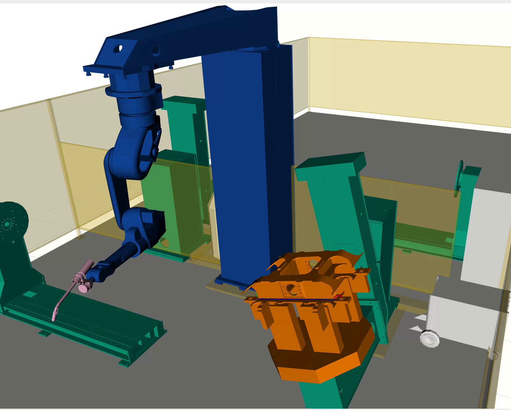{.print-only .intro-fig}
:::
:::

::: {.notes}
1. Plánování trajektorie robota je v principu **inverzní kinematická úloha** aplikovaná na trajektorie.
  - Máme zadanou trajektorii nástroje (hořáku) v souřadnicích **svařence** a výstupem je trajektorie robota v **kloubových souřadnicích**.
  - Kromě toho požadujeme, aby svar byl ve **vodorovné poloze**.
2. Pro každou polohu hořáku máme zadáno **6 omezení** a další **dvě omezení** z požadavku na vodorovnost svaru.
  - K dispozici máme **devět os**, přičemž další případné **stupně volnosti** systému plynou z rozvolnění některých požadavků.
3. Cílem mé práce bylo tento systém **plně zautomatizovat**.
4. Na pravé straně slidu vidíte vizualizaci v prostředí **RViz** s robotem, externí osou a polohovadlem.
  - **Oranžově** je znázorněn svařenec.
:::

## System overview {.smaller}

::: {.columns}
::: {.column width="56%"}
<!-- **Continue using Ceres Solver** -->

::: {.roadmap}
1. **Input parser:** Extract welding poses from G-code.
2. **Free-space planning:** Collision-free path search in the 9D space (OMPL RRT-Connect).
3. **Incremental planning (sequence of continuous optimizations):** An optimisation algorithm minimising criteria as a function of joint coordinates.
4. **Branches (Combinatorial optimization):** Combinatorial optimisation for selecting best branch.
:::
:::
:::

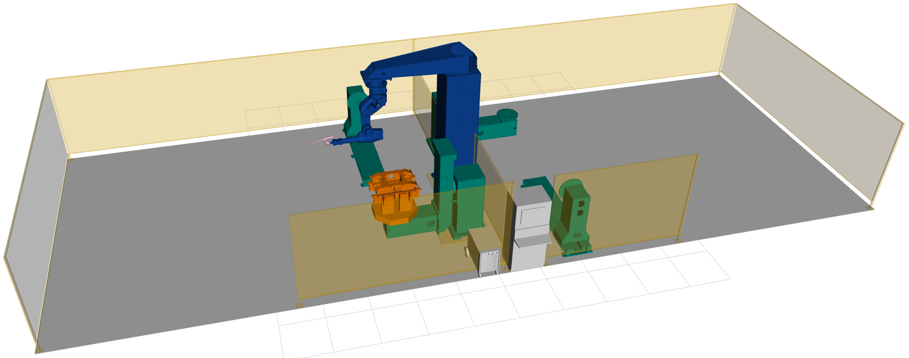{width="75%" fig-align="center"}

::: {.notes}
- Nyní se podíváme na samotný **plánovací proces**, který se skládá ze **čtyř fází**.
1. **Fáze je načtení dat ze vstupních trajektorií**
2. **Fáze je plánování ve volném prostoru**.
  - Kde se potřebujeme **bezpečně a bezkolizně** dostat z výchozí parkovací pozice na **začátek svaru**.
3. **Fáze je inkrementální plánování**.
  - Kde optimalizujeme a minimalizujeme **kritéria** (kloubové limity, rychlosti a kolize) jako **funkci kloubových souřadnic**.
4. **Fáze je větvení.** 
  - Inverzní kinematika nám dává pro každou polohu **více řešení** a z nich vybíráme **to nejlepší**.
:::

## Method of planning {.smaller}

::: {.columns}
::: {.column width="55%"}
**Joints (9 DOF)**

- *Positioner* — 2 DOF: tilt, rotate
- *Arm* — 6 DOF
- *External axis* — 1 DOF

**Criteria**

- joint limits
- velocity
- collision
<!-- - relaxation penalization -->
- ...
:::
::: {.column style="width: 45%; padding-top: 4em;"}
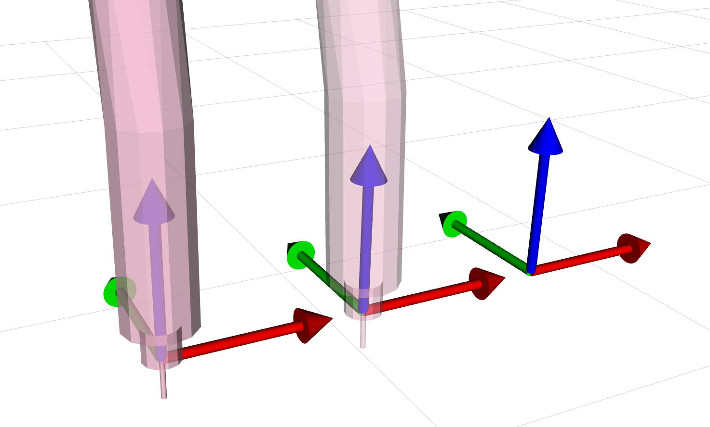{width="90%"}
:::
:::

::: {.notes}
1. Prezentované pracoviště má **devět stupňů volnosti**, které jsou rozděleny do **tří podsystémů**:
  - Polohovadlo (q8, q9), rameno (q2–q7) a externí osa (q1).
2. Jednotlivá kritéria jsme implementovali jako **penalizační funkce**. 
  - Jsou to **kloubové limity**, **rychlosti** a **kolize**.
3. Na obrázku vpravo vidíme **sekvenční plánování** — to znamená, že řešíme **jednu polohu po druhé**:
  - V každé najdeme odpovídající **přípustné kloubové souřadnice**.
<!-- - Používáme **dva tvary** penalizační funkce:  -->
  <!-- - **Jednostranný** nahoře a **oboustranný** dole. -->
<!-- - Například pro kolize penalizujeme **jednostranně** a pro rychlosti **oboustranně**. -->
:::

## Inverse Kinematic Positioner {.smaller}

::: {.columns}
::: {.column width="46%"}
- **Analytical IKT2 (Positioner):** Solves the 2-DOF positioner inverse kinematics.
- **Workpiece alignment:** Calculates tilt and rotate joints to align the weld pose relative to the gravity vector.
- **Multiple branches:** Returns all mathematically valid configurations within joint limits.
<!-- - **Foundation for Ceres:** Provides a fast, reliable analytical base, allowing Ceres Solver to optimize redundancy without numerical instabilities. -->
:::
::: {.column width="54%"}
::: {.columns}
::: {.column width="50%"}
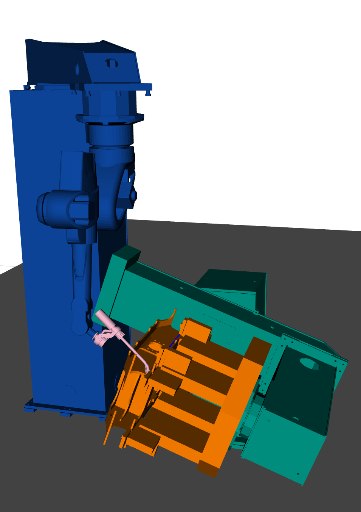{width="100%"}

*a) First configuration*
:::
::: {.column width="50%"}
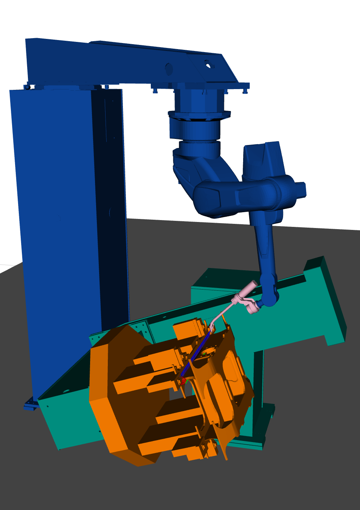{width="100%"}

*b) Second configuration*
:::
:::
:::
:::

::: {.notes}
1. Pro inverzní kinematiku polohovadla jsem implementoval **analytické řešení**.
  - S požadavkem na **orientaci svaru vůči gravitaci**.
2. Ten nám umožňuje **rychle najít řešení** a zároveň poskytuje **více řešení** v rámci kloubových limitů.
   
3. Na tomto slidu vidíte **dvě řešení** — první a druhou **konfiguraci polohovadla**.
:::

## Torch relaxation (3 DOF) {.smaller}

::: {.columns}
::: {.column width="50%"}
Tool deviation in the torch frame: **work angle $\alpha$**, **travel angle $\beta$**, and **spin $\gamma$** (always free — axial symmetry of the torch).

*Rotation order: $\beta \rightarrow \alpha \rightarrow \gamma$.*

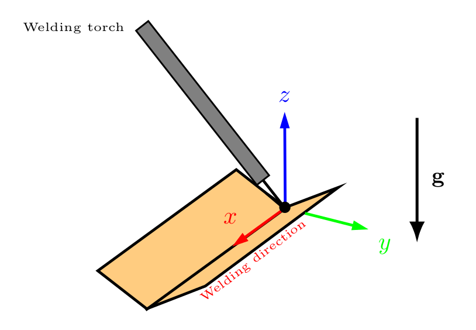{width="70%; transform: translateX(-1em);"}

<!-- *3 DOF at the torch ($\mathbf{g}$ = gravity).* -->
:::
::: {.column width="50%"}
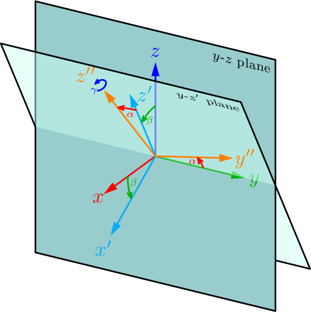{width="140%" style="margin-top: -0.5em; transform: translateX(-1.2em);"}

:::
:::

::: {.notes}
- Pro hořák jsme definovali **tři stupně volnosti** jako **relaxaci**.

- Otáčení kolem osy hořáku o úhel **γ** je **volné**, protože hořák je **symetrický**.

- Odchylka náklonu — úhly **α** a **β**. 
:::

## Positioner relaxation (2 DOF) {.smaller}

::: {.columns}
::: {.column width="45%"}
Tilting the workpiece relative to gravity: **roll $\xi$** (about the X axis) and **slope $\theta$** (about the Y axis) — small deviations from the ideal PA position.

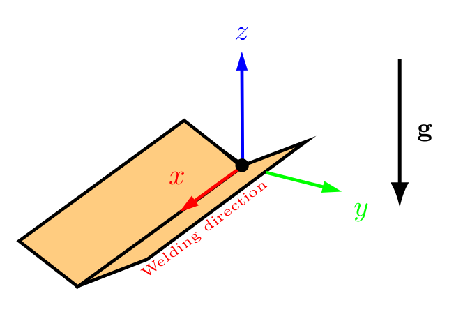{width="98%"}

*Ideal PA position ($\xi = \theta = 0$).*

:::
::: {.column width="55%"}
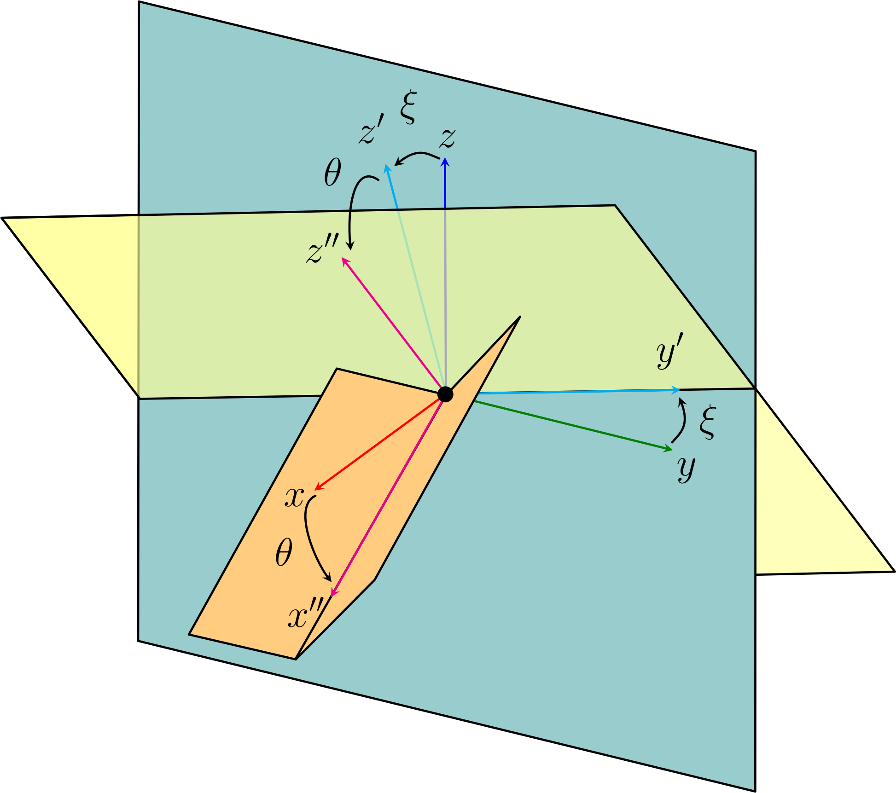{width="100%" style="margin-top: -0.5em;"}

:::
:::
<!-- *Definition of the angles roll $\xi$ and slope $\theta$.* -->

::: {.notes}
- Relaxaci používáme i pro **polohovadlo**.
  
- Odchylka od **ideální orientace** (proti gravitaci) je definována úhly **roll** a **slope**.
  
- **Penalizaci** za odklon hořáku od ideální polohy i za odchylku svaru od vodorovnosti určuje **technolog**.
<!-- - penalizaci pro odklonu horaku od idealni polohy i svaru od vodorovnosti urcuje technolog. -->
<!-- - Tentokrát **technolog** určuje, jak svařovaný model naklonit. -->
:::

<!-- ## Sequence planning (Ceres Solver) {.smaller} -->
## Contribution {.smaller}

::: {.roadmap}
1. **Implementation on a new welding cell**
   - a) Generate SRDF from new URDF in MoveIt 2.
   - b) Update kinematics parameters for the arm solver.
   - c) Extend cost function by adding new criteria.
2. **Positioner integration**
   - a) Implement inverse kinematics solver for the positioner.
   - b) Add orientation requirement to the solver.
   - c) Apply relaxation to the positioner.
3. **Planner migration and extension**
   - a) Migrate to ROS 2 Humble.
   - b) Update optimization solver with new parameters.
   - c) Change node architecture and add user interface.
:::
<!-- **Ceres cost function:**

- Manipulability, limits, velocities.
- Collision-freedom (FCL), smoothness.
- Relaxation penalty.
  
TODO add figure from rviz. -->

::: {.notes}
1. Rád bych shrnul **hlavní přínosy práce**.
2. Implementoval jsem **nové pracoviště**:
  - To zahrnovalo **generování SRDF** a zjednodušení kolizního modelu pro MoveIt 2.
  - Aktualizaci parametrů **kinematického řešiče** pro rameno.
  - Rozšíření **účelové funkce** o nová kritéria.
3. Dále jsem integroval **polohovadlo**:
  - Implementoval jsem pro něj **inverzní kinematický řešič**.
  - Přidal požadavky na orientaci a aplikoval **relaxaci**.
4. Nakonec jsem migroval celý plánovač na **ROS 2 Humble**:
  - Aktualizoval optimalizační řešič s **novými parametry**.
  - Změnil vnitřní komunikaci mezi uzly a přidal **uživatelské rozhraní**.
:::

## Results {.smaller .results-tight}

```{=html}
<style>
  .reveal section.results-tight .columns { gap: 0.3rem !important; }
  .reveal section.results-tight .column { padding: 0 !important; }
</style>
```

**Test part:** Polygonal prism. **2 scenarios:** without relaxation vs. full relaxation.

::: {.columns}
::: {.column width="50%"}
**Without relaxation**

<video id="vid-norelax" class="screen-only" src="figures/workpiece1_non_relax.webm" autoplay muted playsinline style="width:100%; max-height:470px; border-radius:4px; background:#fff; object-fit:contain;"></video>
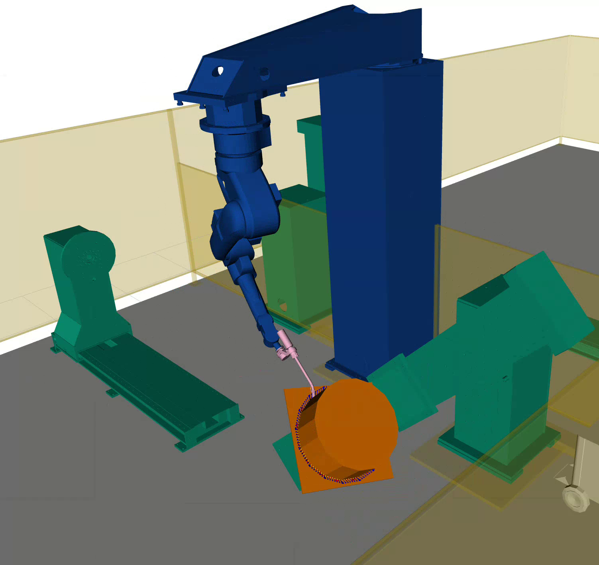

<!-- Jumps, high velocities. -->
:::
::: {.column width="50%"}
**Full relaxation**

<video id="vid-relax" class="screen-only" src="figures/workpiece1_relax.webm" autoplay muted playsinline style="width:100%; max-height:470px; border-radius:4px; background:#fff; object-fit:contain;"></video>
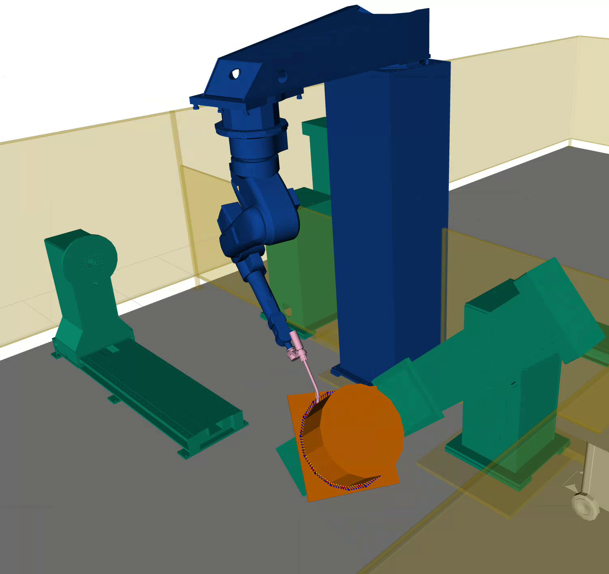

<!-- Smoother motion. -->
:::
:::

```{=html}
<script>
(function () {
  function init() {
    var v1 = document.getElementById('vid-norelax');
    var v2 = document.getElementById('vid-relax');
    if (!v1 || !v2) return;

    var busy = false;
    function restartBoth() {
      if (busy) return;
      busy = true;
      try { v1.pause(); v2.pause(); v1.currentTime = 0; v2.currentTime = 0; } catch (e) {}
      Promise.all([
        v1.play().catch(function () {}),
        v2.play().catch(function () {})
      ]).finally(function () { busy = false; });
    }

    // When either clip finishes, restart both together — guarantees they
    // end at the same time and re-start on the same frame every cycle.
    v1.addEventListener('ended', restartBoth);
    v2.addEventListener('ended', restartBoth);

    // Re-sync whenever this slide becomes the current one (reveal.js).
    if (typeof Reveal !== 'undefined') {
      Reveal.on('slidechanged', function (e) {
        if (e.currentSlide && e.currentSlide.contains(v1)) restartBoth();
      });
      Reveal.on('ready', function () {
        var cur = (Reveal.getCurrentSlide && Reveal.getCurrentSlide()) || null;
        if (cur && cur.contains(v1)) restartBoth();
      });
    }
  }
  if (document.readyState === 'loading') {
    document.addEventListener('DOMContentLoaded', init);
  } else {
    init();
  }
})();
</script>
```

::: {.notes}
- Na závěr bych vám rád ukázal **rozdíl** mezi svařováním **bez relaxace** a **s relaxací**.
  
- U tohoto konkrétního testovacího svařence se ukazuje, že relaxace nepomáhá kvalitě trajektorie v kloubových souřadnicích. 

- Externí osa spolu s polohovadlem vykonává větší pohyby než u trajektorie bez relaxace. 

- V některých případech však tato relaxace umožňuje vyhnout se problematickým konfiguracím a kolizím
:::

## Questions {.qa .smaller transition="zoom" visibility="uncounted" data-state="qa-hide"}

1. **Na straně 3 dole se vysvětluje symbol J(q) a odkazuje se na sekci 2.2 – není to špatně, nemá být spíš 2.3.1 ?**
    Ano, máte pravdu. Jedná se o překlep v textu, správně má být odkaz na sekci 2.3.1.
2. **Na straně 5 se píše o externí rotační ose, ale není vůbec jasné, o co se jedná .. až do kapitoly 2.**
    Ano, není tam dřívější vysvětlení.
3. **Na straně 5 se píše o vodorovné svářecí orientaci, aniž by bylo jasné, o co se vlatně jedná.**
    Máte pravdu, formulace není úplná.
4. **Na straně 10 v úvodu sekce 2.2 student píše o „6-DOF welding pose“, proč nestačí pro popis „welding pose“ jen 5 DOF, když hned v úvodu student uvedl, že torch spin nemá vliv na kvalitu sváru?**
    Ano, pro naši konkrétní úlohu sice stačí 5 DOF, ale 6 DOF jsem zvolil záměrně kvůli obecnosti a přípravě na budoucí aplikace s nesymetrickými nástroji (např. svařování plastů).

::: {.notes}
1. **Symbolu J(q) — sekce 2.2 vs. 2.3.1 (str. 3):** Správně směřovat na sekci 2.3.1, kde je Jakobián a manipulovatelnost skutečně definována.
   
2. **Externí rotační osa (str. 5):** Je to přídavná jednoosá rotační osa (joint_71, E-osa), která je robotická ruka namontována.
   
3. **Vodorovná svářecí orientace (str. 5):** Je to optimální poloha svaru, kdy je svar orientován tak, aby gravitace pomáhala udržet tavnou lázeň ve správné poloze, a polohovadlo se tuto orientaci snaží udržovat.
   
4. **„6-DOF welding pose" vs. 5 DOF (str. 10):** Poloha hořáku v prostoru je vždy šestirozměrná (poloha + orientace).
:::

## Questions {.qa .smaller transition="zoom" visibility="uncounted" data-state="qa-hide"}
1. **Na straně 12 student (poprvé v této práci) použije termín „dexterity“, aniž by ho vysvětlil – o co se jedná?**
    Ano je to manipulovatelnost, která měří schopnost robota pohybovat se v okolí dané konfigurace.
1. **Na straně 23 jsem nepochopil, jestli pro každou „welding pose“ vznikne jen jediná „candidate joint configuration“, anebo zda jich někdy může vzniknout více.**
    Může jich vzniknout více. Inverzní kinematika ramene dává až 8 řešení a polohovadla až 4 řešení. Následně vybere toho optimálního (bez kolizí, s nejnižší cenou a bez nutnosti změny konfigurace).
2. **Na straně 44 jsem narazil na termín „feed rate“, aniž by bylo jasné o co se jedná a v jakých jednotkách se to vyčísluje.**
    Ano, jde o terminologickou nepřesnost. Místo „feed rate“ měl být správně použit termín „welding speed“ (rychlost svařování), který se měří v mm/s.

    <!-- - Odpověď: Poloha hořáku v prostoru je vždy šestirozměrná (poloha + orientace). -->

    <!-- - Odpověď: Je to manipulovatelnost, která měří schopnost robota pohybovat se v okolí dané konfigurace — vysoká manipulovatelnost znamená, že robot může snadno měnit svou konfiguraci bez ztráty schopnosti dosáhnout požadované pozice nástroje. -->

    <!-- - Odpověď: Může jich vzniknout více — IKT6 dává až 8 větví ramene a IKT2 až 4 větve polohovadla, takže plánovač vyčíslí více kandidátů a vybere ten nejlepší (nejnižší cena, bez kolize a bez změny konfigurace). -->

::: {.notes}
1. **Termín „dexterity" (str. 12):** Je to manipulovatelnost, která měří schopnost robota pohybovat se v okolí dané konfigurace — vysoká manipulovatelnost znamená, že robot může snadno měnit svou konfiguraci bez ztráty schopnosti dosáhnout požadované pozice nástroje.
2. **Jedna, nebo více kandidátních konfigurací? (str. 23):** Může jich vzniknout více — IKT6 dává až 8 větví ramene a IKT2 až 4 větve polohovadla, takže plánovač vyčíslí více kandidátů a vybere ten nejlepší (nejnižší cena, bez kolize a bez změny konfigurace).
3. **Termín „feed rate" (str. 44):** Není správně definovaný „feed rate" pro rychlost svarovaní, má být „welding speed".
:::

## Questions {.qa .smaller transition="zoom" visibility="uncounted" data-state="qa-hide"}

1. **Na straně 46 by měl student vysvětlit, jak zapřičiňuje použitý programovací jazyk (C++) plánovače trajektorie nutnost jej rekompilovat kvůli každé úpravě numerického parametru.**
    Napsal jsem tam jasně vysvětlení. Parametry byly v kódu pevně zapsány jako konstanty. Přesunem do ROS 2 se nyní parametry načítají za běhu z YAML souborů, takže není potřeba rekompilace.
2.  **Navrhuji, aby student vysvětlil termín „closed-form solution“, který na několika místech ve své práci použil.**
    Je to vzorec, který vypočítá výsledek přímo konečným počtem algebraických.

    <!-- - Odpověď: není správně definovaný „feed rate" pro rychlost svarovaní, má být „welding speed". -->
    
    <!-- - Odpověď: Parametry jsou v kódu zapsány jako konstanty překládané při kompilaci místo načítání za běhu — přesunem do ROS 2 parametrů jsou zapsaný ve formátu YAML. -->

    <!-- - Odpověď: Validitu neurčují jen vykreslené průběhy ceny, ale i nevykreslená tvrdá omezení (kloubové limity, kolize a detekce změny konfigurace), a v první větvi naráží rotační kloub polohovadla q9 na svůj kloubový limit, takže žádný bod této větve nesplní všechna omezení. -->

    <!-- - Odpověď: Je to vzorec, který vypočítá výsledek přímo konečným počtem algebraických a goniometrických operací bez iterace, na rozdíl od numerického řešiče — analytické IKT6 i IKT2 jsou takovým uzavřeným řešením. -->
<!-- Plain Q&A slide: just the heading, no background (per request). To restore
     the closing banner, delete this line and the closing marker below. -->
<!--
::: {style="background-color: rgba(0,0,0,0.55); padding: 1em 1.4em; border-radius: 0.5em; color: white; display: inline-block;"}
### Thank you for your attention — questions welcome
:::
-->

::: {.notes}
1. **C++ a nutnost rekompilace (str. 46):** Napsal jsem tam nejasné vysvětlení. Parametry byly v kódu pevně zapsány jako konstanty. Přesunem do ROS 2 se nyní parametry načítají za běhu z YAML souborů, takže není potřeba rekompilace.
2.  **Termín „closed-form solution":** Je to vzorec, který vypočítá výsledek přímo konečným počtem algebraických a goniometrických operací bez iterace, na rozdíl od numerického řešiče — analytické IKT6 i IKT2 jsou takovým uzavřeným řešením.
:::

## Questions {.qa .smaller transition="zoom" visibility="uncounted" data-state="qa-hide"}

**Na straně 55 by měl student vysvětlit, na základě čeho lze z grafů (str 52-54) a možných nevyjádřených (!) omezení poznat, že první větev neumožní najít validní konfiguraci.**

:::: {.columns}
::: {.column width="50%"}
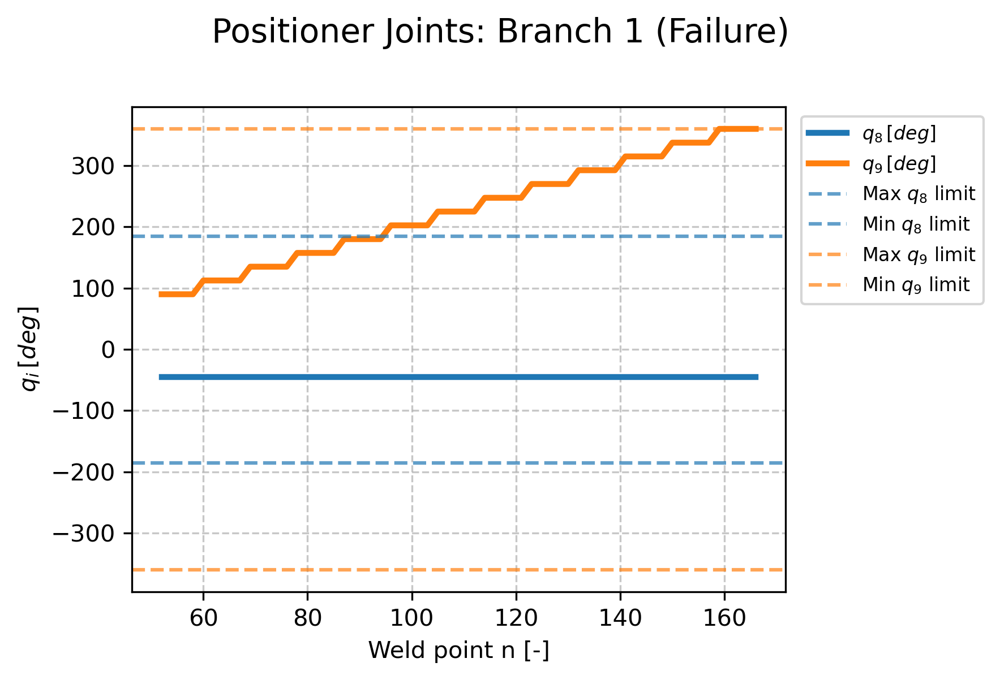{width="100%"}
:::
::: {.column width="50%"}
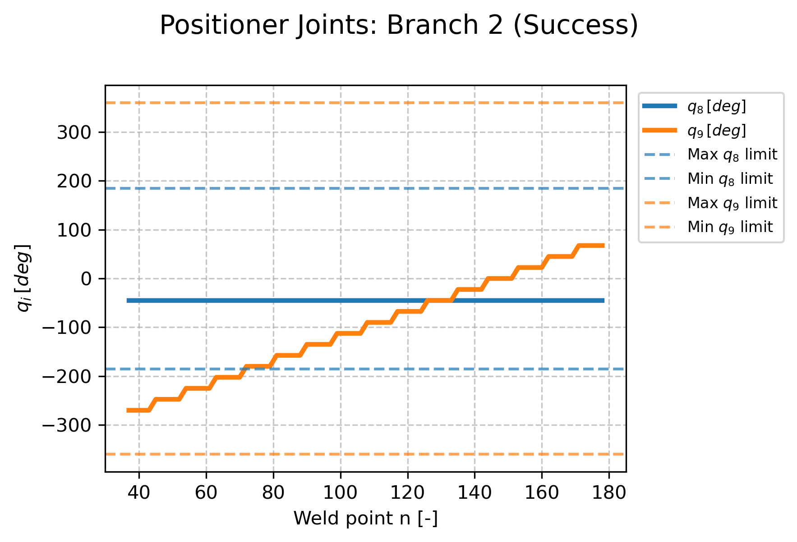{width="100%"}
:::
::::

::: {.notes}
**Validita větve z grafů (str. 55):** Na prvním grafu je vidět, že rotační kloub q9 polohovadla naráží na kloubový limit, který je zobrazen přerušovanou oranžovou čárou. Na druhém grafu naopak robot svařuje v rámci svých kloubových limitů.
:::
